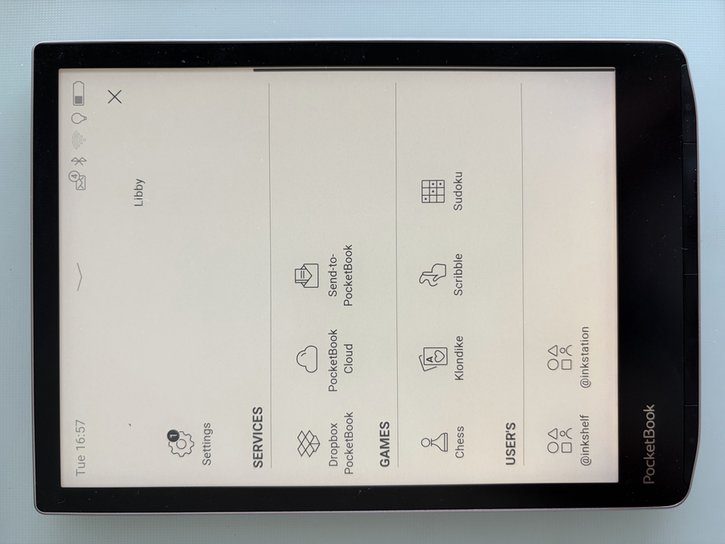
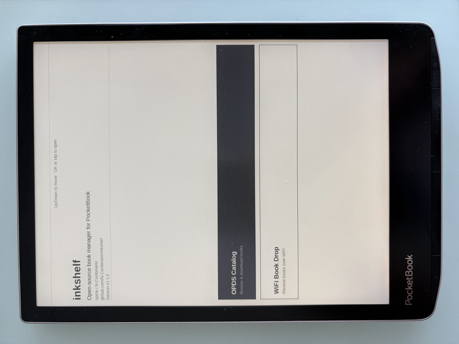
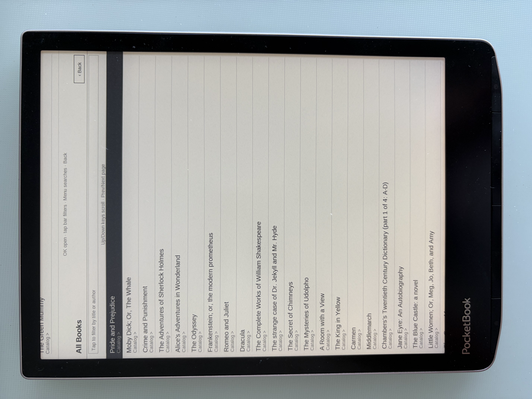
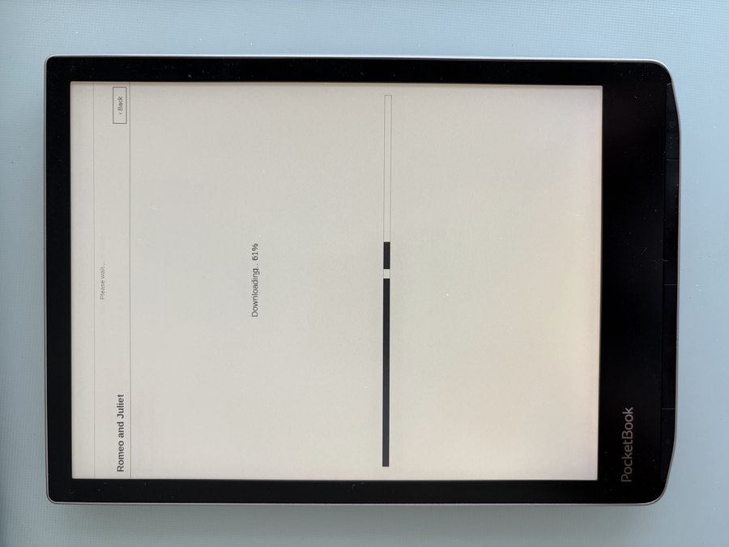
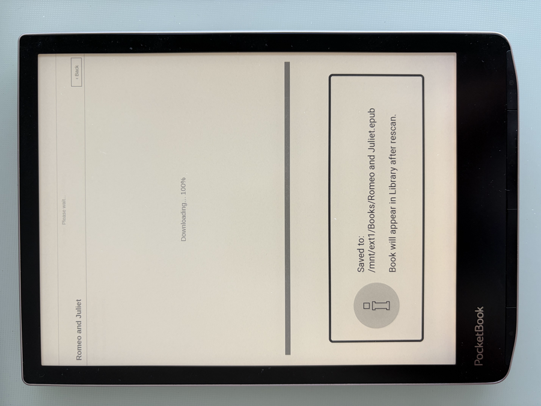

# inkshelf

[](https://github.com/N-Combinator/inkshelf/releases/latest)


Native PocketBook OPDS browser + WiFi book drop — **no KOReader, no jailbreak**.

inkshelf is a single `.app` built against the official PocketBook InkView SDK.
It runs on stock firmware: copy `inkshelf.app` onto the SD card and launch it
from the device's application menu.

**Contents**

- [Screenshots](#screenshots)
- [Install](#install)
- [Features](#features)
- [Using the app](#using-the-app)
- [Updating](#updating)
- [Troubleshooting](#troubleshooting)
- [Building from source](BUILDING.md)

## Screenshots







## Install

**You do not need to build anything.** Every release ships a ready-to-run
`inkshelf.app`; the source build is only for people who want to change the code
(see [BUILDING.md](BUILDING.md)).

1. Download `inkshelf-<version>.zip` from the
   [latest release](https://github.com/N-Combinator/inkshelf/releases/latest)
   and unzip it — inside is a single file, `inkshelf.app`. (It ships zipped
   because GitHub refuses release assets with an `.app` extension.)
2. Connect the reader over USB (or pull its SD card) and copy `inkshelf.app`
   into the `applications/` folder of the storage the reader exposes.
3. Eject the reader and launch **inkshelf** from its Applications menu.

That is the whole install. A PocketBook `.app` is a plain ARM executable that
the launcher runs — there is no signing, no store, no firmware change, and
uninstalling is deleting the file.

Optionally verify it against the `SHA256SUMS.txt` published next to the zip —
it covers both the archive and the `inkshelf.app` inside it, so run it from the
folder holding the downloaded zip and the unzipped binary:

```bash
sha256sum -c SHA256SUMS.txt
```

Every release binary is built by
[GitHub Actions](.github/workflows/release.yml) from the tagged source, so the
build log for the exact file you downloaded is public under the repo's Actions
tab.

**Device support.** The binary is an ARM 32-bit ELF built against the official
SDK (`SDK-B288`, i.e. SDK_6.3.0 branch `6.5`) and targets stock PocketBook
firmware. If it works — or fails to launch — on your model, please open an
issue naming the model and firmware version so this section can list what is
actually verified.

## Features

- **OPDS catalog browser** — point it at any OPDS feed, browse, filter and
  download books straight into the native PocketBook library. Ships with
  presets for [Project Gutenberg](https://www.gutenberg.org) and
  [Flibusta](https://flibusta.is/opds) (Russian-language), plus a custom-URL
  entry via the on-screen keyboard. Every list has a tap-to-filter bar (by
  title/author); long catalogs page with the hardware page-turn keys.
- **WiFi book drop** — starts a tiny HTTP server on the reader; from a PC or
  phone on the same WiFi you open the shown URL and upload `epub`/`fb2` files
  that then appear in the native PocketBook library.
- **Minimal e-ink UI** drawn directly with the InkView API — a nav-stack of
  screens with a reusable list widget, mapped onto the PocketBook key matrix.

## Using the app

Launch **inkshelf** from the device's Applications menu. The home screen shows
an about block (name, version, repo) above two large buttons — pick one with the
hardware up/down keys and OK, or tap it.

### OPDS catalog

Pick a preset (Project Gutenberg, Flibusta) or **Custom URL...** and type a feed
address. Browse the catalog, tap the filter bar to narrow a list, or press
**Menu** to search. Open a book and confirm to download it straight into the
native PocketBook library.

### WiFi Book Drop

1. Make sure the reader is on WiFi, then open **WiFi Book Drop**. inkshelf
   starts an HTTP upload server (default port `8080`) and shows the URL, e.g.
   `http://192.168.1.42:8080`.
2. On a PC or phone on the same network, open that URL in a browser and upload
   one or more `epub`/`fb2` files.
3. Uploaded books are written to the device library and appear in the native
   PocketBook library. Leave the screen to stop the server.

### PIN protection

Every upload and over-the-air deploy requires a 4-digit PIN.

- **First visit** — if no PIN has been saved yet, the screen prompts you to set
  one via the numeric keyboard before the server starts. The PIN is shown on the
  screen next to the URL so you can type it into the browser.
- **Change PIN** — tap *Change PIN* (or press OK) while the server is running.
- **Storage** — saved in `/mnt/ext1/system/config/inkshelf.conf`, reloaded on
  each visit.
- **Protocol** — all `POST /drop` and `POST /deploy` requests must include the
  header `X-Inkshelf-PIN: <pin>`. The browser upload page sends it automatically;
  scripts pass `--pin <PIN>`. A missing or wrong PIN returns `403 Forbidden`.

## Updating

Over USB, the update is the install: copy the new `inkshelf.app` over the old
one in `applications/`.

Without a cable, a running inkshelf can install its own replacement. Open the
**WiFi Book Drop** screen on the reader (so its server is listening), then from
a machine on the same network:

```bash
curl -X POST -H "X-Inkshelf-PIN: 1234" \
  -F "file=@inkshelf.app;type=application/octet-stream" \
  http://<reader-ip>:8080/deploy
```

The swap is atomic and the device restarts the app itself. This only *updates* a
reader that already runs inkshelf — the first install has to go over USB.
(Working from a clone, `./inkshelf-build-wifi.sh --find --pin 1234` does the
same thing plus device discovery; see [BUILDING.md](BUILDING.md).)

## Troubleshooting

### WiFi drops while the app is open

PocketBook firmware powers the WiFi radio down on an idle timer to save battery,
so the connection can silently drop after you sit on a screen or read for a
while — not a bug in inkshelf itself.

inkshelf works around this automatically: it re-asserts the WiFi link before
each OPDS fetch / download (retrying once the radio is back) and before starting
the WiFi Book Drop server, so an idle drop usually recovers on its own with at
most a short pause.

If a request still fails with a connect/DNS/timeout error (shown as
`curl <n>: …`), the radio was likely mid-reconnect — just **retry the action**;
it normally succeeds on the second try. If it keeps failing:

- leave and re-enter the screen (or re-open inkshelf) to force a fresh connect;
- toggle WiFi off/on in the reader's status bar;
- in the reader's *Settings → Connectivity*, raise or disable the
  "disconnect when idle" timeout so the firmware stops powering the radio down.

### The app does not appear in the Applications menu

The file has to be named `inkshelf.app` and sit directly in `applications/`
(not in a subfolder). Some firmware versions only rescan the menu after the
reader is ejected and the USB cable unplugged.

## Contributing

Build instructions, the host test gate, the project layout and the release
process live in **[BUILDING.md](BUILDING.md)**.

## License

MIT.
